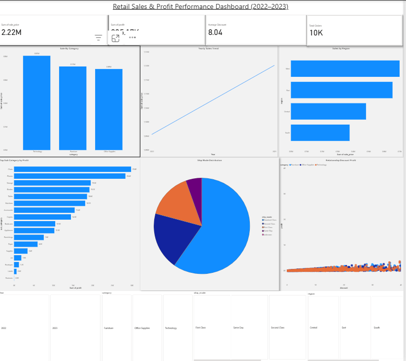

# 🛒 Retail Sales & Profit Analytics — End-to-End Project


> **Tools:** Python · MySQL · Power BI &nbsp;|&nbsp; **Dataset:** 10,000+ rows of retail transactional data &nbsp;|&nbsp; **Domain:** Retail Business Intelligence

---

## 📌 Project Overview

This end-to-end analytics project simulates a real-world retail business analysis workflow. Starting from raw transactional data, the project covers data cleaning, SQL-based KPI analysis, and a fully interactive Power BI dashboard — built to help business stakeholders understand sales performance, profitability, and regional trends.

---

## 🔧 Tech Stack

| Tool | Purpose |
|------|---------|
| Python (Pandas, NumPy) | Data cleaning, preprocessing, EDA |
| MySQL | KPI queries, aggregations, window functions |
| Power BI | Interactive dashboard & business insights |
| GitHub | Version control & portfolio documentation |

---

## 📊 Dashboard Highlights

The Power BI dashboard answers key business questions at a glance:

- **KPI Cards** — Total Sales (2.22M), Total Profit (205K), Avg Discount (8.04), Total Orders (10K)
- **Sales by Category** — Technology leads, followed by Furniture and Office Supplies
- **Yearly Sales Trend** — Clear year-over-year growth from 2022 to 2023
- **Sales by Region** — West region is the top performer
- **Top Sub-Categories by Profit** — Chairs, Phones, and Storage lead profitability
- **Ship Mode Distribution** — Standard Class dominates order fulfillment
- **Discount vs Profit Relationship** — Scatter analysis across all product categories
- **Interactive Filters** — Year, Category, Ship Mode, Region



---

## 🗄️ SQL Queries Included

All scripts are in the `/sql` folder. Key analyses include:

- Total revenue, profit, and average order value
- Category and sub-category performance breakdown
- Regional and city-level sales comparison
- Top 10 highest-selling products
- Top 5 products per region (using window functions)
- Discount impact on profit margins
- Year-over-year and month-over-month sales trends

---

## 💡 Key Business Insights

- **Technology** generates the highest sales and profit of all categories
- **West region** is the most profitable; South is the weakest performer
- **New York City, Los Angeles, and Seattle** are the top 3 cities by revenue
- Sales grew significantly year-over-year from 2022 to 2023
- **Copiers, Machines, and Appliances** show the strongest profit margins
- Higher discounts correlate with lower profit — particularly in Furniture

---

## 📁 Project Structure

```
Retail-Sales-Analytics-Project/
│
├── data/          → raw & cleaned datasets
├── notebook/      → Python data cleaning & EDA (.ipynb)
├── sql/           → all SQL queries used for analysis
├── powerbi/       → Power BI dashboard (.pbix file)
├── images/        → dashboard screenshots & query results
└── README.md      → project documentation
```

---

## 🚀 Future Enhancements

- Sales forecasting using time-series models (ARIMA / Prophet)
- Customer segmentation using clustering (K-Means)
- Automated ETL pipeline using Python + SQLAlchemy
- Enhanced Power BI with drill-through pages and tooltips

---

## 📬 Contact

- **GitHub:** [github.com/saarim-ds](https://github.com/saarim-ds)
- **LinkedIn:** [linkedin.com/in/m-saarim-khan](https://www.linkedin.com/in/m-saarim-khan/)
- **Email:** saarim.yusufzai1@gmail.com
